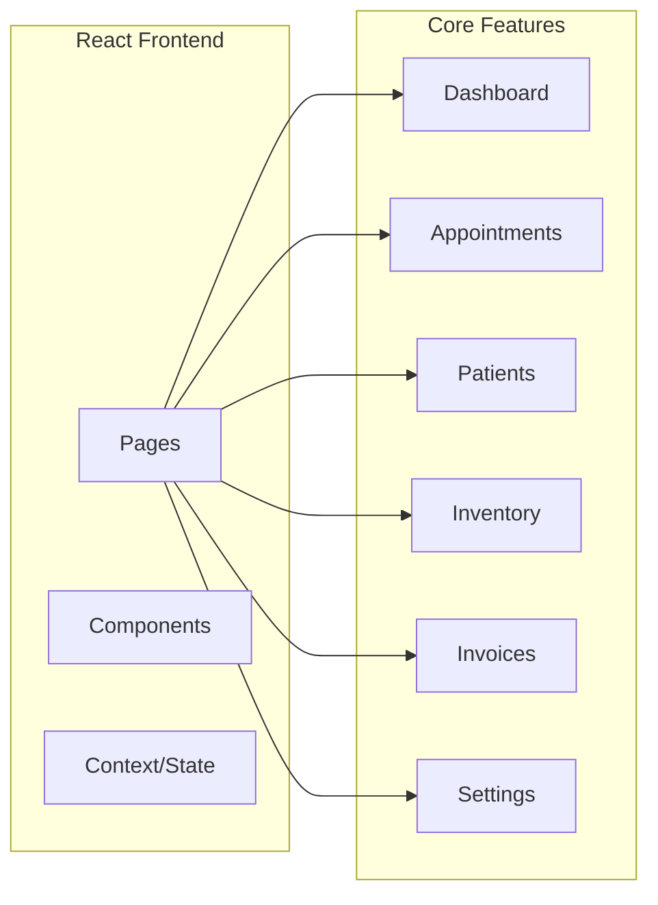

# ClinicFlow Documentation

Welcome to the ClinicFlow documentation. This guide covers the Doctor Dashboard module of the clinic management system.

---

## 📚 Documentation Index

| Document | Description |
|----------|-------------|
| [Quick Start](./quick-start.md) | Get up and running in 5 minutes |
| [Doctor Dashboard](./doctor-dashboard.md) | Complete feature documentation |
| [Components Reference](./components-reference.md) | Detailed component API reference |

---

## 🚀 Quick Links

### For New Developers

1. Start with the [Quick Start Guide](./quick-start.md)
2. Review the [Doctor Dashboard](./doctor-dashboard.md) architecture
3. Explore [Components](./components-reference.md) when building features

### For Designers

- Review the styling section in [Doctor Dashboard](./doctor-dashboard.md#styling)
- Check component styles in [Components Reference](./components-reference.md)

### For Product Managers

- See feature overview in [Doctor Dashboard](./doctor-dashboard.md#overview)
- Review page descriptions in [Doctor Dashboard](./doctor-dashboard.md#pages--components)

---

## 🏗️ Architecture Overview



---

## 📁 Project Structure

```
clinicflow/
├── docs/                    # 📖 Documentation (you are here)
│   ├── README.md           # This file
│   ├── quick-start.md      # Getting started guide
│   ├── doctor-dashboard.md # Full documentation
│   └── components-reference.md # Component API
├── src/
│   ├── pages/              # Page components
│   ├── components/         # Reusable components
│   ├── context/            # React contexts
│   └── i18n/               # Translations
└── public/                 # Static assets
```

---

## 🔧 Technology Stack

| Category | Technology |
|----------|------------|
| Framework | React 18 |
| Routing | React Router v6 |
| Styling | CSS + TailwindCSS |
| Data Tables | DataTables.net |
| Selects | React-Select |
| Icons | Lucide React |
| i18n | Custom (JSON-based) |

---

## 📝 Contributing to Documentation

When adding new features, please update the relevant documentation:

1. **New Page** → Update [doctor-dashboard.md](./doctor-dashboard.md)
2. **New Component** → Update [components-reference.md](./components-reference.md)
3. **New Setup Steps** → Update [quick-start.md](./quick-start.md)

### Documentation Standards

- Use Markdown with GitHub-Flavored extensions
- Include code examples where helpful
- Add Mermaid diagrams for complex concepts
- Keep tables formatted consistently
- Use descriptive headings

---

## 📞 Support

For questions or issues:
- Review the documentation first
- Check the troubleshooting sections
- Contact the development team

---

**Last Updated:** December 2024
