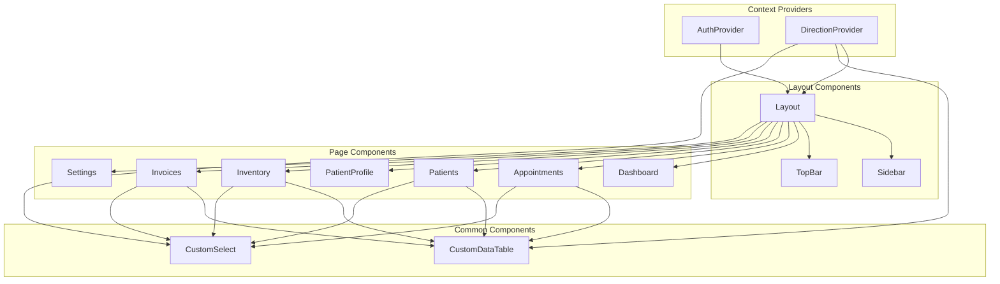

# ClinicFlow Components Reference

A detailed reference guide for all reusable components in the ClinicFlow Doctor Dashboard.

---

## Table of Contents

1. [Layout Components](#layout-components)
   - [Layout](#layout)
   - [Sidebar](#sidebar)
   - [TopBar](#topbar)
2. [Common Components](#common-components)
   - [CustomDataTable](#customdatatable)
   - [CustomSelect](#customselect)
3. [Context Providers](#context-providers)
   - [AuthProvider](#authprovider)
   - [DirectionProvider](#directionprovider)

---

## Layout Components

### Layout

**File:** `src/components/layout/Layout.jsx`

The main layout wrapper that provides the app shell structure including sidebar, top bar, and content area.

#### Props

This component doesn't accept props - it manages internal state and renders child routes via `<Outlet />`.

#### Internal State

| State | Type | Default | Description |
|-------|------|---------|-------------|
| `sidebarCollapsed` | boolean | `false` | Controls sidebar width |
| `mobileMenuOpen` | boolean | `false` | Controls mobile menu visibility |

#### Features

- **Responsive Design** - Adapts to mobile and desktop views
- **Route-based Titles** - Automatically updates page title based on current route
- **Mobile Menu** - Slide-out navigation for mobile devices
- **Body Scroll Lock** - Prevents background scrolling when mobile menu is open

#### Route Title Mapping

```javascript
'/'                → t('nav.dashboard')
'/appointments'    → t('nav.appointments')
'/patients/:id'    → t('patientProfile.title')
'/patients'        → t('nav.patients')
'/inventory'       → t('nav.inventory')
'/invoices'        → t('nav.invoices')
'/settings'        → t('nav.settings')
```

#### Usage

```jsx
// In App.jsx routing
<Route path="/" element={
  <ProtectedRoute>
    <Layout />
  </ProtectedRoute>
}>
  <Route index element={<Dashboard />} />
  {/* Child routes render in <Outlet /> */}
</Route>
```

---

### Sidebar

**File:** `src/components/layout/Sidebar.jsx`

Navigation sidebar with collapsible functionality and mobile support.

#### Props

| Prop | Type | Required | Description |
|------|------|----------|-------------|
| `isCollapsed` | boolean | Yes | Whether sidebar is in collapsed state |
| `onToggle` | function | Yes | Callback to toggle collapsed state |
| `isMobileOpen` | boolean | Yes | Whether mobile menu is open |
| `onMobileClose` | function | Yes | Callback to close mobile menu |

#### Navigation Items

| Path | Icon | Translation Key |
|------|------|-----------------|
| `/` | `LayoutDashboard` | `nav.dashboard` |
| `/appointments` | `Calendar` | `nav.appointments` |
| `/patients` | `Users` | `nav.patients` |
| `/inventory` | `Package` | `nav.inventory` |
| `/invoices` | `FileText` | `nav.invoices` |
| `/settings` | `Settings` | `nav.settings` |

#### CSS Classes

| Class | Description |
|-------|-------------|
| `.sidebar` | Base sidebar container |
| `.collapsed` | Applied when sidebar is collapsed |
| `.mobile-open` | Applied when mobile menu is open |
| `.sidebar-header` | Logo and toggle buttons area |
| `.sidebar-nav` | Navigation links container |
| `.sidebar-footer` | Footer with version info |
| `.nav-item` | Individual navigation link |
| `.nav-item.active` | Active navigation link |

#### Usage

```jsx
<Sidebar 
  isCollapsed={sidebarCollapsed} 
  onToggle={() => setSidebarCollapsed(!sidebarCollapsed)}
  isMobileOpen={mobileMenuOpen}
  onMobileClose={() => setMobileMenuOpen(false)}
/>
```

---

### TopBar

**File:** `src/components/layout/TopBar.jsx`

Top navigation bar with search, notifications, language switcher, theme toggle, and user menu.

#### Props

| Prop | Type | Required | Description |
|------|------|----------|-------------|
| `title` | string | Yes | Current page title to display |
| `onMobileMenuToggle` | function | Yes | Callback to toggle mobile menu |
| `isMobileMenuOpen` | boolean | Yes | Current mobile menu state |

#### Features

- **Dynamic Title** - Displays current page name
- **Search Bar** - Global search input
- **Notifications** - Bell icon with notification badge
- **Language Switcher** - Dropdown to change language (EN/AR/FR)
- **Theme Toggle** - Switch between light/dark mode
- **User Menu** - Profile, settings, and logout options

#### Usage

```jsx
<TopBar 
  title={getTitleByRoute()} 
  onMobileMenuToggle={() => setMobileMenuOpen(!mobileMenuOpen)}
  isMobileMenuOpen={mobileMenuOpen}
/>
```

---

## Common Components

### CustomDataTable

**File:** `src/components/common/CustomDataTable.jsx`

A reusable DataTable component built on top of `datatables.net-react` with built-in RTL support, translations, and theming.

#### Props

| Prop | Type | Required | Default | Description |
|------|------|----------|---------|-------------|
| `data` | array | Yes | - | Array of data objects to display |
| `columns` | array | Yes | - | DataTables column configuration |
| `options` | object | No | `{}` | Additional DataTables options |
| `className` | string | No | `''` | Additional CSS classes |
| `onRowClick` | function | No | - | Callback when row is clicked |
| `children` | ReactNode | No | - | Table header/footer elements |

#### Column Configuration

Columns follow the standard [DataTables column definition](https://datatables.net/reference/option/columns):

```javascript
const columns = [
  { 
    data: 'name',           // Property name in data object
    title: t('patients.name'), // Column header
    render: (data) => data  // Optional render function
  },
  {
    data: 'status',
    title: t('patients.status'),
    render: (data) => `<span class="badge badge-${data}">${data}</span>`
  },
  {
    data: null,             // For action columns
    title: t('common.actions'),
    orderable: false,
    render: (data, type, row) => `
      <button class="btn btn-sm" data-id="${row.id}">Edit</button>
    `
  }
];
```

#### Default Options

```javascript
{
  responsive: true,
  pageLength: 10,
  language: {
    search: t('common.search'),
    lengthMenu: `${t('common.show')} _MENU_ ${t('common.entries')}`,
    info: `${t('common.showing')} _START_ ${t('common.to')} _END_ ${t('common.of')} _TOTAL_ ${t('common.entries')}`,
    paginate: {
      first: t('common.first'),
      last: t('common.last'),
      next: isRTL ? '←' : '→',
      previous: isRTL ? '→' : '←'
    },
    emptyTable: t('common.noData'),
    zeroRecords: t('common.noData')
  },
  order: [[0, 'asc']],
  dom: '<"datatable-header"lf>rt<"datatable-footer"ip>'
}
```

#### Row Click Handling

The component automatically handles row clicks and passes the correct data object to the callback:

```javascript
const handleRowClick = (rowData, event) => {
  // Check if an action button was clicked
  if (event.target.closest('.btn-edit')) {
    handleEdit(rowData);
  } else if (event.target.closest('.btn-delete')) {
    handleDelete(rowData.id);
  }
};

<CustomDataTable
  data={patients}
  columns={columns}
  onRowClick={handleRowClick}
/>
```

#### Usage Examples

**Basic Usage:**

```jsx
import CustomDataTable from '../components/common/CustomDataTable';

function PatientList() {
  const { t } = useTranslation();
  
  const columns = [
    { data: 'name', title: t('patients.name') },
    { data: 'phone', title: t('patients.phone') },
    { data: 'email', title: t('patients.email') }
  ];

  return (
    <CustomDataTable
      data={patients}
      columns={columns}
      className="patients-table"
    />
  );
}
```

**With Custom Options:**

```jsx
<CustomDataTable
  data={invoices}
  columns={invoiceColumns}
  options={{
    pageLength: 25,
    order: [[1, 'desc']], // Sort by second column descending
    scrollX: true
  }}
  onRowClick={(invoice, e) => handleInvoiceClick(invoice)}
/>
```

---

### CustomSelect

**File:** `src/components/common/CustomSelect.jsx`

A styled dropdown select component built on `react-select` with consistent theming and RTL support.

#### Props

| Prop | Type | Required | Default | Description |
|------|------|----------|---------|-------------|
| `options` | array | Yes | `[]` | Array of `{ value, label }` objects |
| `value` | object \| null | No | `null` | Currently selected value(s) |
| `onChange` | function | Yes | - | Change handler `(selectedOption) => void` |
| `placeholder` | string | No | `'Select...'` | Placeholder text |
| `isClearable` | boolean | No | `true` | Allow clearing selection |
| `isSearchable` | boolean | No | `true` | Allow searching options |
| `isMulti` | boolean | No | `false` | Allow multiple selections |
| `isDisabled` | boolean | No | `false` | Disable the select |
| `className` | string | No | `''` | Additional CSS class |
| `customStyles` | object | No | `{}` | Custom styles to merge |

#### Option Format

```javascript
const options = [
  { value: 'active', label: 'Active' },
  { value: 'inactive', label: 'Inactive' },
  { value: 'pending', label: 'Pending' }
];
```

#### Default Styles

The component includes pre-configured styles matching the app theme:

- Border radius: 8px
- Focus color: #2A7CFF
- Hover states
- Proper z-index for dropdowns
- RTL support via `isRTL` from DirectionContext

#### Usage Examples

**Single Select:**

```jsx
import CustomSelect from '../components/common/CustomSelect';

function StatusFilter() {
  const [status, setStatus] = useState(null);
  
  const statusOptions = [
    { value: 'active', label: 'Active' },
    { value: 'inactive', label: 'Inactive' }
  ];

  return (
    <CustomSelect
      options={statusOptions}
      value={status}
      onChange={setStatus}
      placeholder="Filter by status"
    />
  );
}
```

**Multi Select:**

```jsx
<CustomSelect
  options={categoryOptions}
  value={selectedCategories}
  onChange={setSelectedCategories}
  isMulti={true}
  placeholder="Select categories"
/>
```

**With Custom Styles:**

```jsx
<CustomSelect
  options={options}
  value={selected}
  onChange={setSelected}
  customStyles={{
    control: (base, state) => ({
      ...base,
      minHeight: '48px',
      borderWidth: '2px'
    })
  }}
/>
```

---

## Context Providers

### AuthProvider

**File:** `src/context/AuthContext.jsx`

Provides authentication state and methods throughout the application.

#### Context Value

| Property | Type | Description |
|----------|------|-------------|
| `user` | object \| null | Current user data |
| `isAuthenticated` | boolean | Authentication status |
| `login` | function | Login method |
| `logout` | function | Logout method |

#### User Object Structure

```javascript
{
  id: 1,
  name: 'Dr. Ahmed',
  email: 'doctor@clinic.com',
  role: 'admin',
  avatar: null
}
```

#### Methods

**login(email, password)**

```javascript
const { login } = useAuth();

const handleSubmit = async () => {
  const result = login(email, password);
  if (result.success) {
    navigate('/');
  } else {
    setError(result.error);
  }
};
```

**logout()**

```javascript
const { logout } = useAuth();

const handleLogout = () => {
  logout();
  navigate('/login');
};
```

#### Hook Usage

```javascript
import { useAuth } from '../context/AuthContext';

function ProfileMenu() {
  const { user, isAuthenticated, logout } = useAuth();

  if (!isAuthenticated) {
    return <LoginButton />;
  }

  return (
    <div>
      <span>Welcome, {user.name}</span>
      <button onClick={logout}>Logout</button>
    </div>
  );
}
```

#### Storage

Auth state is persisted to localStorage under `auth-user` key.

---

### DirectionProvider

**File:** `src/context/DirectionContext.jsx`

Provides RTL/LTR direction, language, theme, and translations throughout the application.

#### Context Value

| Property | Type | Description |
|----------|------|-------------|
| `direction` | 'ltr' \| 'rtl' | Current text direction |
| `setDirection` | function | Set direction directly |
| `toggleDirection` | function | Toggle between LTR/RTL |
| `language` | string | Current language code |
| `setLanguage` | function | Set language directly |
| `changeLanguage` | function | Change language (auto-sets direction) |
| `languageConfig` | object | Available languages config |
| `isRTL` | boolean | Is RTL mode active |
| `translations` | object | Current language translations |
| `theme` | 'light' \| 'dark' | Current theme |
| `setTheme` | function | Set theme mode |
| `toggleTheme` | function | Toggle light/dark |
| `isDark` | boolean | Is dark mode active |

#### Available Hooks

**useDirection()**

```javascript
import { useDirection } from '../context/DirectionContext';

function App() {
  const { direction, isRTL, changeLanguage } = useDirection();
  
  return (
    <div style={{ textAlign: isRTL ? 'right' : 'left' }}>
      {/* content */}
    </div>
  );
}
```

**useTranslation()**

```javascript
import { useTranslation } from '../context/DirectionContext';

function Header() {
  const { t, language } = useTranslation();
  
  return (
    <header>
      <h1>{t('dashboard.title')}</h1>
      <span>Current: {language}</span>
    </header>
  );
}
```

**useTheme()**

```javascript
import { useTheme } from '../context/DirectionContext';

function ThemeToggle() {
  const { theme, toggleTheme, isDark } = useTheme();
  
  return (
    <button onClick={toggleTheme}>
      {isDark ? '☀️' : '🌙'}
    </button>
  );
}
```

#### Language Configuration

```javascript
const languageConfig = {
  en: { name: 'English', dir: 'ltr', flag: '🇺🇸' },
  ar: { name: 'العربية', dir: 'rtl', flag: '🇸🇦' },
  fr: { name: 'Français', dir: 'ltr', flag: '🇫🇷' }
};
```

#### Translation Function

The `t()` function supports nested keys with dot notation:

```javascript
const { t } = useTranslation();

// Simple key
t('common.save');          // "Save"

// Nested key
t('patients.form.name');   // "Patient Name"

// With fallback
t('unknown.key', 'Default Text');
```

#### Storage

- Direction: `localStorage.getItem('app-direction')`
- Language: `localStorage.getItem('app-language')`
- Theme: `localStorage.getItem('app-theme')`

#### HTML Attributes

The provider automatically sets these on `<html>`:

```html
<html dir="ltr" lang="en" data-theme="light">
```

---

## Component Diagram



---

## Adding New Components

### Component File Template

```jsx
import React from 'react';
import { useTranslation } from '../../context/DirectionContext';

/**
 * MyComponent - Description of what this component does
 * 
 * @param {Object} props
 * @param {string} props.title - Component title
 * @param {Function} props.onClick - Click handler
 */
function MyComponent({ title, onClick }) {
  const { t } = useTranslation();

  return (
    <div className="my-component">
      <h2>{title}</h2>
      <button onClick={onClick}>
        {t('common.submit')}
      </button>
    </div>
  );
}

export default MyComponent;
```

### Best Practices

1. **Use Translations** - Always use `t()` for user-facing text
2. **Consider RTL** - Use logical properties (start/end vs left/right)
3. **Support Theming** - Use CSS custom properties for colors
4. **Document Props** - Add JSDoc comments for component props
5. **Handle Loading** - Show appropriate loading states
6. **Error Boundaries** - Wrap complex components with error handling

---

## License

This project is proprietary software. All rights reserved.
