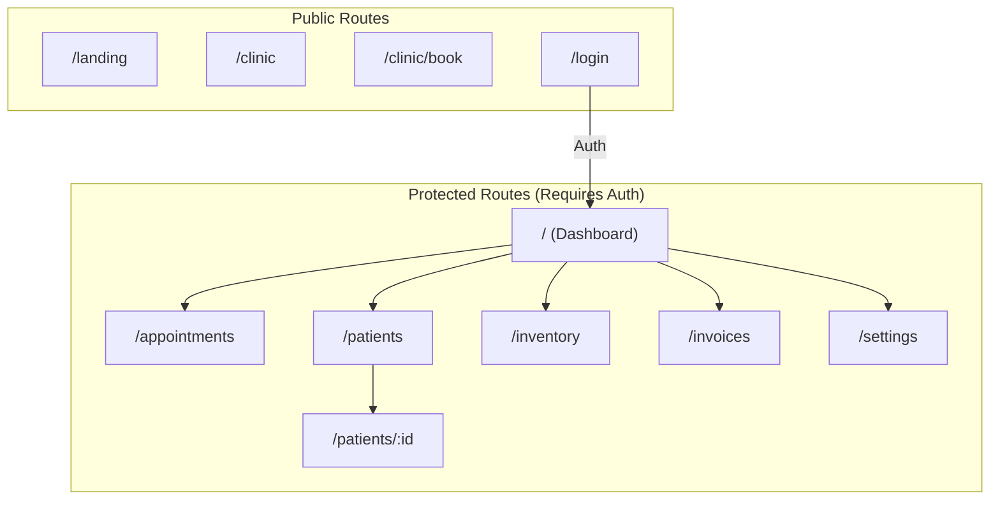

# ClinicFlow Doctor Dashboard Documentation

A comprehensive guide to the Doctor Dashboard module of ClinicFlow - a modern clinic management system built with React.

---

## Table of Contents

1. [Overview](#overview)
2. [Architecture](#architecture)
3. [Pages & Components](#pages--components)
   - [Dashboard](#dashboard)
   - [Appointments](#appointments)
   - [Patients](#patients)
   - [Patient Profile](#patient-profile)
   - [Inventory](#inventory)
   - [Invoices](#invoices)
   - [Settings](#settings)
4. [Shared Components](#shared-components)
5. [Context & State Management](#context--state-management)
6. [Internationalization (i18n)](#internationalization-i18n)
7. [Routing](#routing)
8. [Styling](#styling)

---

## Overview

The Doctor Dashboard is a protected section of ClinicFlow that provides healthcare professionals with tools to manage their daily operations. It includes:

- **Real-time Statistics** - View appointments, revenue, and patient metrics
- **Appointment Management** - Schedule, reschedule, and track patient appointments
- **Patient Records** - Manage patient information and visit history
- **Inventory Control** - Track medical supplies and equipment
- **Billing & Invoicing** - Generate and manage patient invoices
- **Clinic Settings** - Configure clinic preferences and schedules

---

## Architecture



### Directory Structure

```
src/
├── App.jsx                      # Main app entry with routing
├── App.css                      # Global styles
├── components/
│   ├── common/
│   │   ├── CustomDataTable.jsx  # Reusable data table component
│   │   └── CustomSelect.jsx     # Styled select dropdown
│   └── layout/
│       ├── Layout.jsx           # Main layout wrapper
│       ├── Sidebar.jsx          # Navigation sidebar
│       └── TopBar.jsx           # Top navigation bar
├── context/
│   ├── AuthContext.jsx          # Authentication state
│   └── DirectionContext.jsx     # RTL/LTR & theme context
├── i18n/
│   ├── en.json                  # English translations
│   ├── ar.json                  # Arabic translations
│   └── fr.json                  # French translations
└── pages/
    ├── Dashboard/
    │   └── Dashboard.jsx        # Main dashboard page
    ├── Appointments/
    │   └── Appointments.jsx     # Appointment management
    ├── Patients/
    │   └── Patients.jsx         # Patient list & management
    ├── PatientProfile/
    │   └── PatientProfile.jsx   # Individual patient view
    ├── Inventory/
    │   └── Inventory.jsx        # Inventory management
    ├── Invoices/
    │   └── Invoices.jsx         # Invoice management
    └── Settings/
        └── Settings.jsx         # Clinic settings
```

---

## Pages & Components

### Dashboard

**File:** `src/pages/Dashboard/Dashboard.jsx`

The main dashboard provides an at-a-glance overview of clinic operations.

#### Features

| Feature | Description |
|---------|-------------|
| **Statistics Cards** | Displays key metrics with trend indicators |
| **Today's Appointments** | Quick view of scheduled appointments |
| **Quick Actions** | One-click access to common tasks |

#### Statistics Displayed

| Metric | Icon | Description |
|--------|------|-------------|
| Appointments Today | Calendar | Number of scheduled appointments |
| Monthly Revenue | DollarSign | Total revenue for the month |
| New Patients | Users | Count of new patient registrations |
| Avg Wait Time | Clock | Average patient wait time |

#### Quick Actions

- **New Appointment** → Navigates to `/appointments`
- **Add Patient** → Navigates to `/patients`
- **Create Invoice** → Navigates to `/invoices`
- **View Reports** → Navigates to `/settings`

#### Status Badges

Appointments display status using the `StatusBadge` component:
- `confirmed` - Appointment confirmed
- `pending` - Awaiting confirmation
- `canceled` - Appointment canceled

---

### Appointments

**File:** `src/pages/Appointments/Appointments.jsx`

A comprehensive appointment scheduling and management system.

#### Features

| Feature | Description |
|---------|-------------|
| **Calendar View** | Weekly calendar with time slots |
| **List View** | Tabular view of all appointments |
| **Drag & Drop** | Reschedule by dragging appointments |
| **Filters** | Filter by patient name, type, and status |
| **CRUD Operations** | Create, read, update, delete appointments |

#### View Modes

1. **Calendar View** - Week-based calendar with hourly time slots
2. **List View** - Data table with sortable columns

#### Key Functions

| Function | Purpose |
|----------|---------|
| `getWeekDates()` | Generates array of dates for current week |
| `navigateWeek(direction)` | Navigate to previous/next week |
| `onDragEnd(result)` | Handles drag & drop rescheduling |
| `handleAdd()` | Opens modal to create new appointment |
| `handleEdit(apt)` | Opens modal to edit existing appointment |
| `handleDelete(aptId)` | Removes appointment from list |
| `handleSave()` | Saves new or edited appointment |
| `resetFilters()` | Clears all applied filters |

#### Appointment Fields

| Field | Type | Description |
|-------|------|-------------|
| `id` | number | Unique identifier |
| `day` | number | Day of week (0-6) |
| `time` | string | Time slot (e.g., "09:00") |
| `patient` | string | Patient name |
| `type` | string | Appointment type |
| `duration` | number | Duration in minutes |
| `notes` | string | Additional notes |

---

### Patients

**File:** `src/pages/Patients/Patients.jsx`

Patient management with advanced filtering and search capabilities.

#### Features

| Feature | Description |
|---------|-------------|
| **Data Table** | Paginated list with sorting |
| **Advanced Filters** | Filter by status, blood type |
| **Search** | Real-time search across all fields |
| **CRUD Operations** | Full patient management |
| **Profile Links** | Click to view detailed profile |

#### Key Functions

| Function | Purpose |
|----------|---------|
| `handleAdd()` | Opens modal for new patient |
| `handleEdit(patient)` | Opens edit modal with patient data |
| `handleDelete(patientId)` | Removes patient record |
| `handleSaveAdd()` | Saves new patient |
| `handleSaveEdit()` | Updates existing patient |
| `handleRowClick(patient, e)` | Handles row selection and actions |
| `resetFilters()` | Clears all filters |

#### Patient Data Model

| Field | Type | Description |
|-------|------|-------------|
| `id` | number | Unique identifier |
| `name` | string | Patient full name |
| `phone` | string | Contact phone number |
| `email` | string | Email address |
| `lastVisit` | string | Date of last visit |
| `status` | string | active/inactive |
| `age` | number | Patient age |
| `address` | string | Full address |
| `bloodType` | string | Blood type (A+, B-, etc.) |
| `dob` | string | Date of birth |

---

### Patient Profile

**File:** `src/pages/PatientProfile/PatientProfile.jsx`

Detailed view of an individual patient's information and history.

#### Layout Structure

```
┌─────────────────────────────────────────────────────────┐
│ ← Back to Patients                      [Edit Profile]  │
├─────────────────────────────────────────┬───────────────┤
│                                         │               │
│  ┌─── Info Card ───────────────────┐    │ Insurance     │
│  │ [Avatar] Name, Age, Blood Type  │    │ Info Card     │
│  │ Phone | Email | DOB | Address   │    │               │
│  └─────────────────────────────────┘    ├───────────────┤
│                                         │               │
│  ┌─── Visit History ───────────────┐    │ Medical       │
│  │ Timeline of past visits         │    │ Info Card     │
│  │ [+ Add Visit]                   │    │               │
│  └─────────────────────────────────┘    ├───────────────┤
│                                         │               │
│                                         │ Quick Notes   │
│                                         │               │
└─────────────────────────────────────────┴───────────────┘
```

#### Sections

| Section | Content |
|---------|---------|
| **Info Card** | Contact details, avatar, basic info |
| **Visit History** | Timeline of all visits with notes |
| **Insurance Info** | Provider and policy details |
| **Medical Info** | Blood type, allergies |
| **Quick Notes** | Notepad for quick observations |

---

### Inventory

**File:** `src/pages/Inventory/Inventory.jsx`

Comprehensive inventory management for medical supplies and equipment.

#### Features

| Feature | Description |
|---------|-------------|
| **Tab Navigation** | Switch between Items, Categories, Movements |
| **Category Management** | Organize items into categories |
| **Stock Tracking** | Monitor quantity and minimum stock levels |
| **Movement History** | Track stock in/out transactions |
| **Barcode Support** | Generate and manage item barcodes |

#### Tabs

1. **Items** - Main inventory list
2. **Categories** - Manage product categories
3. **Movements** - Stock transaction history

#### Key Functions

| Function | Purpose |
|----------|---------|
| `getCategoryName(catId)` | Returns category name by ID |
| `getStockStatus(item)` | Calculates stock level status |
| `generateBarcode()` | Creates new barcode for items |
| `handleAddCategory()` | Creates new category |
| `handleAddItem()` | Adds new inventory item |
| `handleAddMovement(type)` | Records stock in/out |
| `handleSaveMovement()` | Persists stock transaction |

#### Stock Status Indicators

| Status | Condition |
|--------|-----------|
| 🟢 In Stock | quantity > minStock |
| 🟡 Low Stock | quantity ≤ minStock |
| 🔴 Out of Stock | quantity = 0 |

#### Item Data Model

| Field | Type | Description |
|-------|------|-------------|
| `id` | number | Unique identifier |
| `barcode` | string | Item barcode |
| `name` | string | Item name (English) |
| `nameAr` | string | Item name (Arabic) |
| `categoryId` | number | Reference to category |
| `quantity` | number | Current stock level |
| `minStock` | number | Minimum stock threshold |
| `unit` | string | Unit of measurement |
| `costPrice` | number | Purchase price |
| `sellPrice` | number | Selling price |

---

### Invoices

**File:** `src/pages/Invoices/Invoices.jsx`

Invoice management and billing system.

#### Features

| Feature | Description |
|---------|-------------|
| **Data Table** | Sortable, filterable invoice list |
| **Status Filters** | Filter by paid/pending/overdue |
| **Print Support** | Generate printable invoices |
| **CRUD Operations** | Full invoice management |

#### Key Functions

| Function | Purpose |
|----------|---------|
| `handleAdd()` | Creates new invoice |
| `handleEdit(invoice)` | Opens edit modal |
| `handleDelete(invoiceId)` | Removes invoice |
| `handleSave()` | Persists invoice data |
| `handlePrint()` | Generates print view |
| `handleRowClick(invoice, e)` | Handles row actions |
| `resetFilters()` | Clears all filters |

#### Invoice Status

| Status | Badge Color | Description |
|--------|-------------|-------------|
| `paid` | Success | Payment received |
| `pending` | Warning | Awaiting payment |
| `overdue` | Danger | Past due date |

#### Invoice Data Model

| Field | Type | Description |
|-------|------|-------------|
| `id` | string | Invoice number (e.g., "INV-001") |
| `patient` | string | Patient name |
| `date` | string | Invoice date |
| `amount` | number | Total amount |
| `status` | string | paid/pending/overdue |
| `service` | string | Service provided |
| `dueDate` | string | Payment due date |

---

### Settings

**File:** `src/pages/Settings/Settings.jsx`

Clinic configuration and preferences.

#### Features

| Feature | Description |
|---------|-------------|
| **Clinic Info** | Name, address, contact details |
| **Working Hours** | Configure daily schedule |
| **Working Days** | Toggle operational days |
| **Preferences** | Theme, language settings |

#### Key Functions

| Function | Purpose |
|----------|---------|
| `toggleWorkingDay(index)` | Enables/disables a working day |

#### Settings Sections

1. **Clinic Information** - Basic clinic details
2. **Working Hours** - Start and end times
3. **Working Days** - Day-by-day availability
4. **Notifications** - Email/SMS preferences

---

## Shared Components

### CustomDataTable

**File:** `src/components/common/CustomDataTable.jsx`

A reusable data table component with built-in features:

- Pagination
- Sorting
- Search
- Custom column rendering
- Row click handling

### CustomSelect

**File:** `src/components/common/CustomSelect.jsx`

A styled select dropdown component that integrates with the theme system.

### Layout Components

| Component | File | Purpose |
|-----------|------|---------|
| `Layout` | `Layout.jsx` | Main layout wrapper with sidebar |
| `Sidebar` | `Sidebar.jsx` | Navigation menu |
| `TopBar` | `TopBar.jsx` | Top navigation with user menu |

---

## Context & State Management

### DirectionContext

**File:** `src/context/DirectionContext.jsx`

Provides app-wide state for:

| State | Type | Description |
|-------|------|-------------|
| `direction` | 'ltr' \| 'rtl' | Text direction |
| `language` | string | Current language code |
| `theme` | 'light' \| 'dark' | Color theme |
| `translations` | object | Translation strings |

#### Hooks

```javascript
// Direction and language
const { direction, isRTL, changeLanguage } = useDirection();

// Translations
const { t, language } = useTranslation();

// Theme
const { theme, toggleTheme, isDark } = useTheme();
```

#### Supported Languages

| Code | Language | Direction |
|------|----------|-----------|
| `en` | English | LTR |
| `ar` | العربية | RTL |
| `fr` | Français | LTR |

### AuthContext

**File:** `src/context/AuthContext.jsx`

Manages authentication state:

```javascript
const { isAuthenticated } = useAuth();
```

---

## Internationalization (i18n)

Translations are stored in JSON files under `src/i18n/`:

### Usage

```javascript
const { t } = useTranslation();

// Simple key
t('dashboard.title');

// Nested key
t('appointment.status.confirmed');

// With default value
t('unknown.key', 'Default Value');
```

### Translation Structure

```json
{
  "dashboard": {
    "title": "Dashboard",
    "appointmentsToday": "Appointments Today",
    "monthlyRevenue": "Monthly Revenue"
  },
  "common": {
    "save": "Save",
    "cancel": "Cancel",
    "delete": "Delete"
  }
}
```

---

## Routing

### Route Configuration

| Route | Component | Access |
|-------|-----------|--------|
| `/landing` | LandingPage | Public |
| `/clinic` | ClinicHome | Public |
| `/clinic/book` | BookingPage | Public |
| `/login` | Login | Public (redirects if authenticated) |
| `/` | Dashboard | Protected |
| `/appointments` | Appointments | Protected |
| `/patients` | Patients | Protected |
| `/patients/:id` | PatientProfile | Protected |
| `/inventory` | Inventory | Protected |
| `/invoices` | Invoices | Protected |
| `/settings` | Settings | Protected |

### Protected Routes

Protected routes are wrapped with the `ProtectedRoute` component which:
1. Checks `isAuthenticated` from AuthContext
2. Redirects to `/login` if not authenticated
3. Renders children if authenticated

```jsx
<ProtectedRoute>
  <Layout />
</ProtectedRoute>
```

---

## Styling

### Technology Stack

- **CSS** - Vanilla CSS with custom properties
- **TailwindCSS** - Utility-first CSS framework

### Theme System

The app supports light and dark themes via CSS custom properties:

```css
:root {
  --bg-primary: #ffffff;
  --text-primary: #1a1a1a;
}

[data-theme="dark"] {
  --bg-primary: #1a1a1a;
  --text-primary: #ffffff;
}
```

### Key CSS Classes

| Class | Description |
|-------|-------------|
| `.card` | Standard card container |
| `.btn` | Base button styles |
| `.btn-primary` | Primary action button |
| `.btn-ghost` | Ghost/secondary button |
| `.badge` | Status badge |
| `.stat-card` | Statistics card |
| `.modal` | Modal overlay |
| `.form-group` | Form field wrapper |

---

## Getting Started

### Prerequisites

- Node.js 16+
- npm or yarn

### Installation

```bash
# Clone the repository
git clone <repository-url>
cd clinicflow

# Install dependencies
npm install

# Start development server
npm run dev
```

### Environment Variables

Create a `.env` file:

```env
REACT_APP_API_URL=http://localhost:3001
```

---

## Best Practices

### Adding New Pages

1. Create component in `src/pages/<PageName>/PageName.jsx`
2. Add route in `src/App.jsx`
3. Add translations in `src/i18n/*.json`
4. Add navigation link in Sidebar if needed

### Adding Translations

1. Add keys to all language files (`en.json`, `ar.json`, `fr.json`)
2. Use the `t()` function to access translations
3. Follow the nested key structure

### State Management

- Use React Context for global state
- Use local state (`useState`) for component-specific state
- Use `useMemo` for derived state to prevent unnecessary re-renders

---

## License

This project is proprietary software. All rights reserved.
